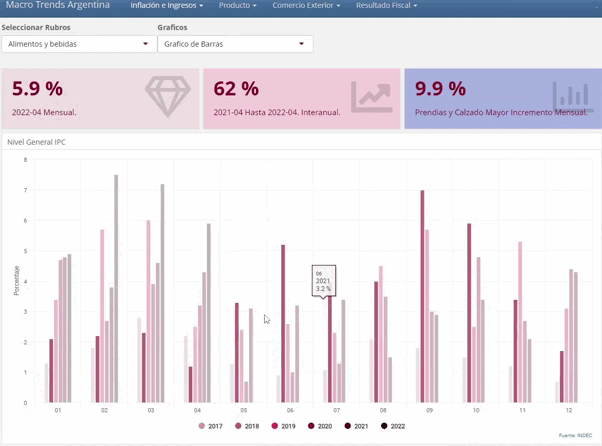

# Argentina Macro Trends

Proyecto en Curso que consiste en un dashboard dinamico de Variables Macroeconomicas para Argentina usando el Framework Shiny. Este dashboard se alimenta de los datos suministrados por el Indec.

# Incluye

<ui>

<li>
Extraccion, Transformacion y Carga.
</li>

<li>
Graficos Dinamicos y Estaticos.
</li>

</ui>

# Paquetes de R

<ui>

<li>
{tidyverse}
</li>

<li>
{plotly}
</li>

<li>
{highcharter}
</li>

<li>
{Shiny}
</li>

<li>
{flexdashboard}
</li>

</ui>

# Gif

  

# Link

<ui>

<li>
https://www.indec.gob.ar/
</li>

</ui>

